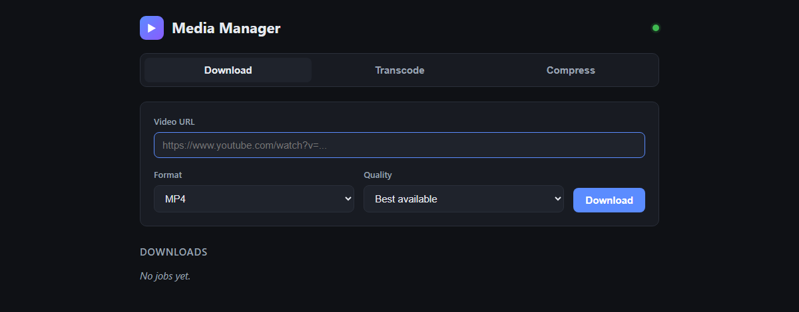
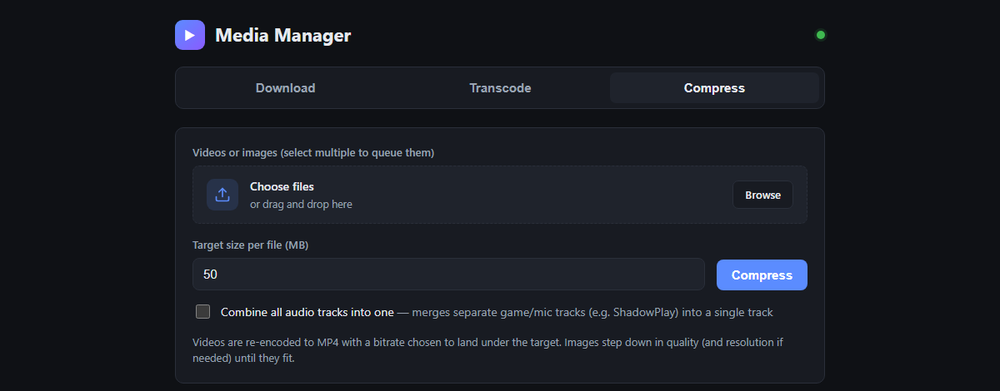

<p align="center">
  
</p>

<h1 align="center">media_manager</h1>

<p align="center">
  A small self-hosted web app that downloads, converts, and compresses media —
  then cleans up after itself.
</p>

<p align="center">
  <a href="https://github.com/BBareth/media_manager/actions/workflows/ci.yml"></a>
  <a href="https://github.com/BBareth/media_manager/pkgs/container/media_manager"></a>
  <a href="./LICENSE"></a>
  
</p>

---

Three things, one container, no accounts and no library to curate:

- **Download** — pull video or audio from YouTube and the [hundreds of other
  sites `yt-dlp` supports](https://github.com/yt-dlp/yt-dlp/blob/master/supportedsites.md).
  Choose the container (MP4, MKV, WebM, MP3, M4A, OPUS, OGG, WAV, FLAC) and a
  quality ceiling up to 4K.
- **Transcode** — convert an uploaded file to another format with `ffmpeg`.
  AVI → MP4, MKV → MP4, MP3 → OGG, and anything else ffmpeg can do here.
- **Compress** — give it a target size in megabytes and it gets under it.
  Videos are re-encoded at a resolution and frame rate the target bitrate can
  actually support ([why that matters](#why-compression-changes-the-resolution)),
  then measured and encoded again if they came out over anyway; images (JPG,
  PNG, WebP, BMP, TIFF) step down in quality, and in resolution if that is not
  enough. Select several files to queue them.

Finished files are yours to pull straight to the browser. Everything on the
server is transient: anything older than the retention window (one day by
default) is deleted automatically, so the disk never fills up.

Transcode and Compress can also **merge separate audio tracks into one**, which
is what you want for recordings that keep game and microphone audio apart —
ShadowPlay, OBS multi-track, and similar.

<p align="center">
  
  <br>
  <em>Paste a URL, pick a format, done.</em>
  <br><br>
  
  <br>
  <em>Or drop in files and name a size to land under.</em>
</p>

> [!WARNING]
> **There is no authentication.** This is built for a trusted machine or a
> trusted LAN. Do not expose it directly to the internet — put a VPN or an
> authenticating proxy in front of it. See [SECURITY.md](./SECURITY.md) for the
> full trust model.

## Quick start

```bash
docker run -d --name media_manager \
  -p 8080:8080 \
  -v media_data:/data \
  --restart unless-stopped \
  ghcr.io/bbareth/media_manager:latest
```

Open <http://localhost:8080>.

<details>
<summary><b>docker compose</b></summary>

Grab [`docker-compose.yml`](./docker-compose.yml) and:

```bash
docker compose up -d
```

</details>

<details>
<summary><b>Portainer</b></summary>

**Stacks → Add stack**, paste the contents of
[`docker-compose.yml`](./docker-compose.yml), deploy, then open
`http://<host>:8080`.

</details>

### Image tags

| Tag            | What it is                                           |
| -------------- | ---------------------------------------------------- |
| `latest`       | The newest tagged release. Use this.                 |
| `0.1.1`, `0.1` | A specific release, pinned.                          |
| `edge`         | Built from `main` on every push. Expect rough edges. |

Images are published for `linux/amd64` and `linux/arm64`.

## Configuration

Everything is an environment variable; there is no config file.

| Variable               | Default              | What it does                                    |
| ---------------------- | -------------------- | ----------------------------------------------- |
| `PORT`                 | `8080`               | HTTP port inside the container.                 |
| `MEDIA_RETENTION_SECS` | `86400` (1 day)      | Age at which files and job records are deleted. |
| `MEDIA_DATA_DIR`       | `/data`              | Working files. Mount a volume here.             |
| `MEDIA_STATIC_DIR`     | `/app/static`        | Built frontend assets. Set inside the image.    |
| `RUST_LOG`             | `media_manager=info` | Log filter, in `tracing` syntax.                |

`/data` is scratch space. It does not need backups — its contents are purged on
a schedule. What it does need is **room**: if your Docker root disk is small,
bind-mount a directory on a larger one instead of using a named volume.

The container runs as **uid 10001**, not root. A fresh named volume picks that
up on its own; a bind-mounted host directory has to be made writable first:

```bash
sudo chown -R 10001:10001 /srv/media_manager_data
```

## How it works

- **Backend** — Rust, [Axum](https://github.com/tokio-rs/axum). One static
  binary, state held in memory, no database.
- **Frontend** — TypeScript and React, built by Vite, served by the same binary.
  No component library and no state manager.
- **Media tools** — `yt-dlp` and `ffmpeg`, bundled in the image.

Each job gets a UUID-named folder under `/data`. Downloads run `yt-dlp` with a
format selector derived from your quality choice. Transcodes stream the upload
to disk, probe its duration with `ffprobe` so the progress bar is real rather
than a guess, and then run `ffmpeg`. The frontend polls `/api/jobs` for
progress, and a sweep every 30 minutes deletes anything past its retention age,
including stray folders left by earlier runs.

`yt-dlp` is installed from PyPI into a virtualenv rather than used as the
standalone binary, which self-extracts at runtime and fails on hosts with a
small `/tmp`.

## Why compression changes the resolution

The naive approach to "make this 12 MB" is to re-encode at the source's own
dimensions and let the bitrate fall wherever it lands. That produces a blocky
mess, and it is slow. Measured on a 2560×1440 60 fps game capture, 60 seconds
targeted at 12 MB, six cores of a desktop CPU from 2017:

| Encode                     | Time     | Bits per pixel |
| -------------------------- | -------- | -------------- |
| 1440p60, preset medium     | 95 s     | 0.0068         |
| 1080p60, preset medium     | 71 s     | 0.0121         |
| 1080p30, preset medium     | 50 s     | 0.0241         |
| **1080p30, preset faster** | **43 s** | **0.0241**     |
| 720p30, preset faster      | 33 s     | 0.0543         |

Two things follow. Encode time tracks **pixels per second** almost linearly, so
resolution and frame rate — not the x264 preset — are what make it slow;
loosening the preset alone bought about 25 %. And at 0.0068 bits per pixel a
1440p frame is being asked to describe four million pixels with almost nothing,
which is *why* the output looked bad.

So scaling down is not a compromise here. It makes the picture better and the
wait shorter at the same time.
[`backend/src/encode_plan.rs`](./backend/src/encode_plan.rs) picks the largest
rung of a standard ladder whose bits-per-pixel clears a floor, halves a 60 fps
source before it gives up a resolution rung, and never upscales. The job's
detail line tells you what it chose (`… · 1080p @ 30`).

**If it is still slower than you want**, the lever is hardware encoding. The
image ships software x264 only, because that is the one thing guaranteed to
work everywhere. A host with a GPU or an Intel iGPU can do roughly 5–10× better
at some cost in quality per bit, but it needs the render device passed through
to the container — `--device /dev/dri/renderD128` for Docker, or the equivalent
device line on an LXC container — and a code change to select an accelerated
encoder such as `h264_qsv`, `h264_nvenc`, or `h264_vaapi`. That is a welcome
contribution; see [CONTRIBUTING.md](./CONTRIBUTING.md).

## API

The frontend is an ordinary client of this; nothing is privileged.

| Method   | Path                  | Body                            | Purpose                       |
| -------- | --------------------- | ------------------------------- | ----------------------------- |
| `GET`    | `/api/health`         | —                               | Returns `ok`.                 |
| `POST`   | `/api/downloads`      | JSON `{ url, format, quality }` | Start a download.             |
| `POST`   | `/api/transcode`      | multipart `file`, `format`, `combine_audio` | Start a conversion. |
| `POST`   | `/api/compress`       | multipart `file`, `target_mb`, `combine_audio` | Start a size-targeted encode. |
| `GET`    | `/api/jobs`           | —                               | Every job, newest first.      |
| `GET`    | `/api/jobs/{id}`      | —                               | One job.                      |
| `GET`    | `/api/jobs/{id}/file` | —                               | Stream the finished output.   |
| `DELETE` | `/api/jobs/{id}`      | —                               | Delete a job and its files.   |

```bash
curl -X POST http://localhost:8080/api/downloads \
  -H 'content-type: application/json' \
  -d '{"url":"https://example.com/watch?v=...","format":"mp4","quality":"1080"}'
```

## Development

You need Rust (stable), Node 20+, and `ffmpeg`, `ffprobe`, and `yt-dlp` on your
`PATH`.

```bash
# terminal 1 — backend on :8080
cd backend && cargo run
```

```bash
# terminal 2 — frontend on :5173, proxying /api to :8080
cd frontend && npm install && npm run dev
```

For a production-style local run, build the frontend and point the backend at
the output:

```bash
cd frontend && npm run build && cd ../backend
MEDIA_STATIC_DIR=../frontend/dist cargo run --release
```

Building the image yourself, optionally pinning `yt-dlp`:

```bash
docker build -t media_manager .
```

```bash
docker build --build-arg YTDLP_VERSION=2025.05.22 -t media_manager .
```

Contributions are welcome — [CONTRIBUTING.md](./CONTRIBUTING.md) covers the
setup, what CI checks, and the house style.

## Licence and fair use

[MIT](./LICENSE).

This tool automates `yt-dlp` and `ffmpeg`; it does not host, index, or
redistribute anything. What you may download is between you, the site's terms,
and your local copyright law. Please respect all three.
